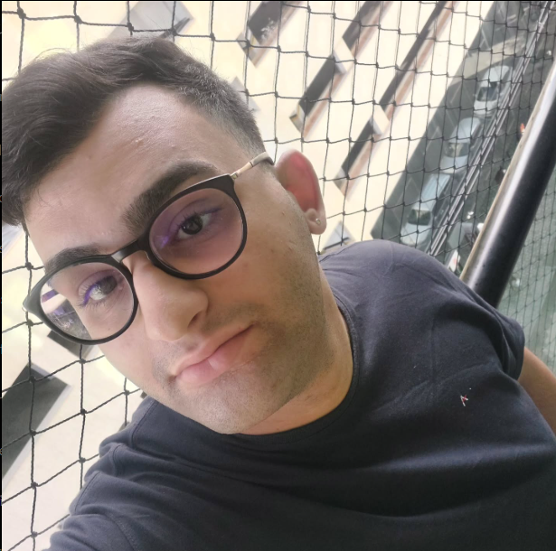

  

<h1 align="center">Olá, sou Bernardo Chimelli Luz 👋</h1>

  <strong>Desenvolvedor Full Stack</strong> com foco em <strong>React.js</strong>, <strong>Node.js</strong>, <strong>Python</strong> e <strong>C#</strong> 
  Estudante de Engenharia de Software | Três Rios - RJ, Brasil

---

### 🚀 Sobre mim

- 🎓 Estudante de **Engenharia de Software**
- 🌐 Atualmente desenvolvendo meu **portfólio pessoal**
- 📚 Focado em tecnologias **Full Stack**
- 💡 Apaixonado por resolver problemas com código limpo e eficiente

---

### 🛠️ Tecnologias que utilizo

---

### 🌐 Contato

- 📧 E-mail: [bernardochimelliluz14@gmail.com](mailto:bernardochimelliluz14@gmail.com)
- 💼 LinkedIn: [linkedin.com/in/bernardo-chimelli-649628311](https://www.linkedin.com/in/bernardo-chimelli-649628311)
- 💻 GitHub: [github.com/bcl19](https://github.com/bcl19)

---

### 📌 Em breve

- 🔨 Lançamento do meu **portfólio pessoal completo** com projetos e blog técnico!

---

  
  

